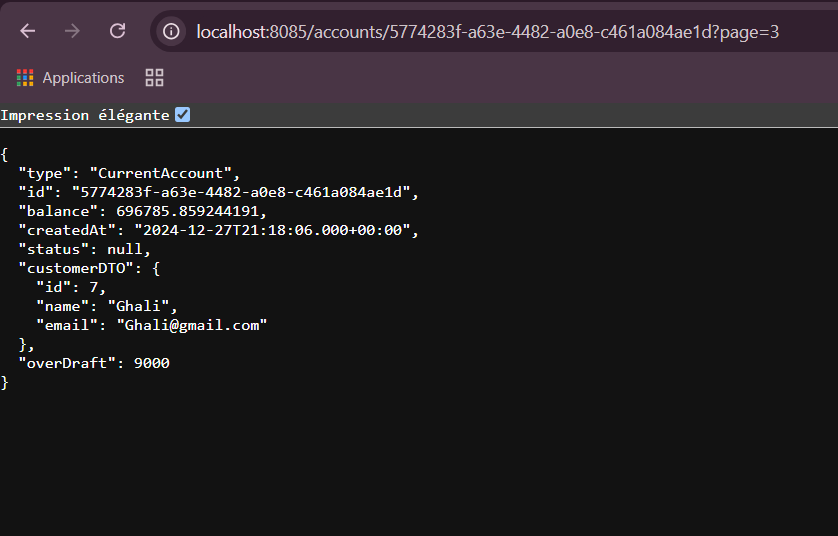

# Gestion de Comptes Bancaires

Ce projet est une solution complète pour gérer les clients et leurs comptes bancaires. Il inclut des fonctionnalités avancées pour enregistrer les opérations bancaires et offrir des services via des API REST documentées. Deux types de comptes sont disponibles : comptes courants et comptes épargnes.
## Fonctionnalités

Gestion des informations des clients et des comptes.

Suivi des opérations bancaires, notamment les transactions de type DEBIT et CREDIT.

Accès aux services via des API REST.

Documentation interactive des API avec Swagger.
---

## Structure du Projet

### Partie 1 : Backend

Le backend de l’application est conçu avec Spring Boot. Voici les principales étapes pour le développer :
### Étapes de développement :

1. **Initialisation du projet**
   - Configurez un projet Spring Boot via Spring Initializr avec les dépendances requises.

2. **Modélisation des entités JPA** :
   - `Customer` : Entité représentant un client bancaire.
   - `BankAccount` : Classe de base pour gérer les comptes.
   - `SavingAccount` : hérite de `BankAccount`, Représente les comptes épargnes.
   - `CurrentAccount` : hérite de `BankAccount`, Représente les comptes courants.
   - `AccountOperation` : Enregistre les transactions bancaires (DEBIT et CREDIT).

3. **Configuration des JPA Repositories**
   - Implémentez des interfaces Spring Data JPA pour interagir avec la base de données.

   - <h1>Base de donnees H2</h1>

   - 
   - <h3>Table Customer</h3>
   - 
   - <h3>Table des operations</h3>
   - 
   - <h3>Table comptes courants</h3>
   - 
   - <h3>Table saving accounts</h3>
   - 
- <h1>Base de donnees Sql</h1>
   - 
   - 
   - 
   - 
   

   
   
   - <h2>Consultation de la liste des comptes</h2>
   - 
   - <h2>Consultation d'un compte</h2>
   - 
   - <h2>Consultation des opérations d'un compte</h2>
   - 
   - <h2>Pagination</h2>
   - 
   - <h2>Test avec postman</h2>
   - <h2>affichage des customers</h2>
- 
- <h2>ajouter customer</h2>

- 
- <h2>delete customer</h2>
  
- 
- <h2>affichage des customers par id</h2>
  
- 
- <h2>modifier customers</h2>
  
- 


4. **Tests des opérations DAO**
- Assurez-vous que les opérations CRUD fonctionnent correctement via des tests unitaires ou d’intégration.
5. **Logique métier et DTOs**
- Développez des services pour gérer la logique métier.
- Utilisez des DTOs pour la transmission de données entre les différentes couches.
6. **Exposition des API REST**
- Implémentez des RestControllers pour fournir un accès aux services backend.
7. **Documentation avec Swagger**
- Intégrez Swagger pour décrire et tester vos API REST.
   - 


   
## Installation et Exécution


1. Installez les dépendances :
   ```bash
   mvn clean install
   ```

2. Lancez l'application :
   ```bash
   mvn spring-boot:run
   ```


